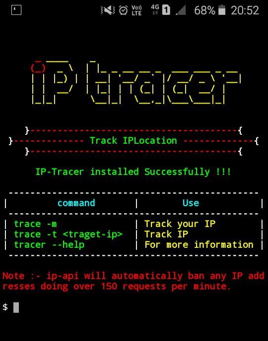

## What is IP-Tracer ?

Facebook IP-Tracer and Password finder is used to track an user ip address and discovering exact coordinate of the target and password. Facebook IP-Tracer password finder is developed for Termux and Linux based systems. you can easily retrieve user password, ip address and coordinate information using FB IP-Tracer. Facebook IP-Tracer use FB ip-api to track users ip address, loging details and target exact coordinate.

## How to install FB IP-Tracer and Password Finder?

* `apt update`

* `apt install git -y`

* `git clone https://github.com/Binaries1010100/IP-Tracer.git`

* `cd IP-Tracer`

* `chmod +x install`

* `sh install` or `./install`

## How to use FB IP-Tracer and Password Finder?

* `trace -f target-fb-ip` to track other's Facebook ip address for example `ip-tracer -f 192.168.0.1`

* `trace -p target-password` to get users login details for example `ip-tracer -p fb id of victim`

* `trace -t target-ip` to track other's ip address for example `ip-tracer -t 127.0.0.1`

* `trace -m` to track your own ip address.

* `trace` for more information.

**OR**

* `ip-tracer -f target-fb-ip` to track other's Facebook ip address for example `ip-tracer -f 192.168.0.1`

* `ip-tracer -p target-password` to get users login details for example `ip-tracer -p fb id of victim`

* `ip-tracer -t target-ip` to track other's ip address for example `ip-tracer -t 127.0.0.1`

* `ip-tracer -m` to track your own ip address.

* `ip-tracer` for more information.

# facebook-ip-trace
# facebook-ip-trace
# facebook-ip-trace
